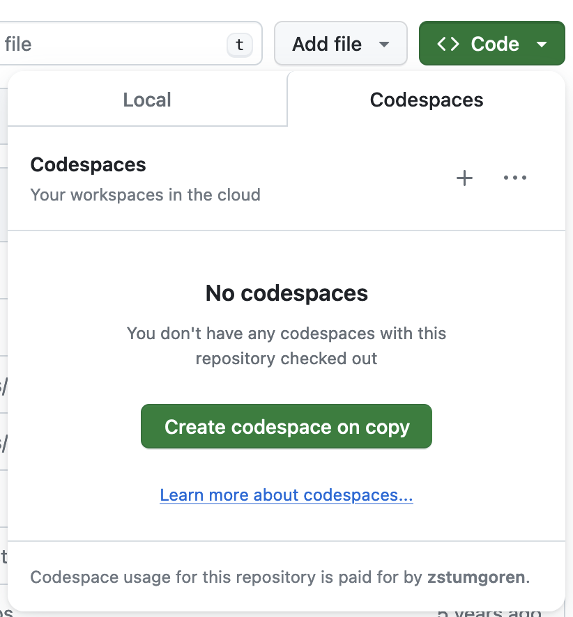

# Teacher's Guide

First off, a hearty thanks if you plan to help teach this course at NICAR! We appreciate you paying it forward :)

Below is a rough overview (current as of NICAR24) to help onboard folks as teachers with (hopefully) as little friction as possible.

Generally, each lesson plan includes the following elements:

- `<folder>/README.md` - outline of the lesson plan, with important points to hit
- `<folder>/<notebook.ipynb>` - notebook with exercises (but no solutions) intended for students to work with during class
- `completed/<notebook_completed.ipynb>` - a completed notebook containing solutions for the corresponding `<folder>/<notebook.ipynb>`. Instructors can print this or use a second screen to guide the lesson.

Below are additional details on each lesson plan.

## The Codespaces Two-Step

As of NICAR24, we're using [GitHub Codespaces](https://github.com/features/codespaces) to work in Jupyter Notebooks. The goal is to minimize installation headaches by providing a preconfigured, cloud-based environment.

At the start of class, instructors should:

- Direct students to log into their GitHub accounts
- Go to the class repo on GH
- Click the big green `Code` button
- Select the Codespaces tab
- Click the big green `Create codespace...` button. 

Here's a screenshot:

It usually takes a few minutes to initially spin up due to customizations we've made to the environment. 

Might be helpful during this time to provide a brief overview of Codespaces, noting in particular that it uses VS Code so everything they're about to learn in the cloud transfers easily to working on their own machines beyond class. 

Also worth mentioning: 

- It's a freemium model and generally they shouldn't incur any charges (or have to put down a credit card) with reasonable usage levels.
- The coding environment is saved for a day (or two?), so students can pick up their work on Day 2 right where they left off.

### Codespace customizations

The Codespaces environment for this repo has been customized to use a recent version of Python and to automatically install various libraries used in the lessons (e.g. `pandas`), along with important VS Code extensions for Python and Jupyter.

To update the Python version and add dependencies or VS Code extensions, check out the Codespace configuration and Dockerfile in the `.devcontainer` folder. Also relevant is the GitHub action that controls the build process: `.github//workflows/docker-image.yaml`.

If you discover you're missing a library in the middle of class, as a simple fallback you can open the terminal shell and just `pip install` libraries as needed.

Also, note that whenever you create/open a Jupyter Notebook for the first time in Codespaces, you'll need to select a Python kernel. Codespaces/VS Code typically prompts you to select the kernel on the first attempt to run a notebook cell with an `import` statement. It's an arcane bit of workflow for students new to programming, but it should only take a few moments to walk them through the process.

## Basics

Provides an overview of basic Python data types and syntax. Here's the order of operations:

- `basics/README.md` - Big picture on coding and outline of Python language basics that will be covered in the first notebook.
- [basics/basics_reference_notebook.ipynb](basics/basics_reference_notebook.ipynb) - exercise notebook that students should open and work in during the lesson ([teacher's guide/solutions](completed/basics_reference_completed.ipynb))
- [basics/basics_notebook.ipynb](basics/basics_notebook.ipynb) - Iliad word frequency exercise ([teacher's guide/solutions](completed/basics_complete_notebook.ipynb))

## Project 1

TK

## Project 2 

> This is obsolete as of NICAR 2024. Skip straight to Project 3

## Project 3

TK